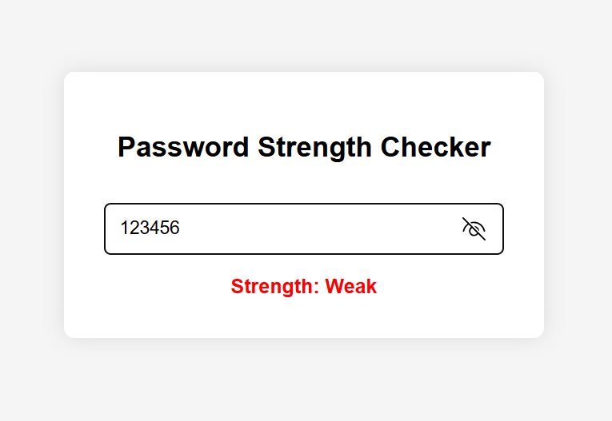
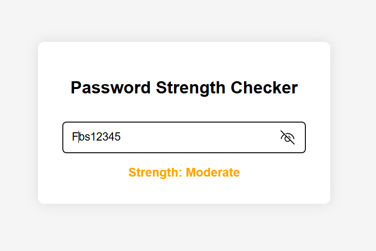
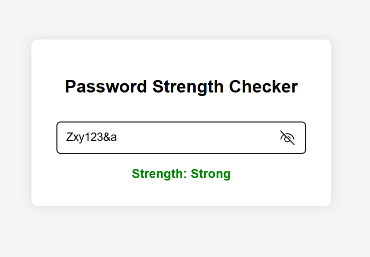

# 🔐 Password Strength Checker

This is a simple web app that checks the strength of a password as you type, built with HTML, CSS, and JavaScript.

## 🚀 Features

- Real-time feedback on password strength
- Checks for:
  - Minimum length (8+ characters)
  - Uppercase and lowercase letters
  - Numbers
  - Special characters

## 📸 Screenshot

 
 
 

## 🛠 How to Use

1. Clone this repository
2. Open index.html in your browser
3. Start typing a password to see the strength meter in action

## 📂 Project Structure
 password-strength-checker/
 
├── index.html

├── style.css

├── script.js

├── weakpass.png

├── moderatepass.png

├── Strongpass.png

└── README.md
